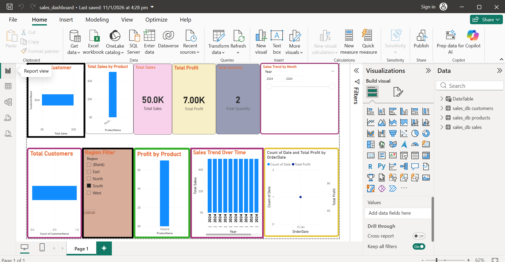

### Power BI Sales Dashboard 📊

#### 📌 Overview
This project is an interactive **Sales Performance Dashboard** built using **Power BI**.  
It helps analyze sales data to understand **revenue, profit, quantity sold, and customer behavior**
across **time, region, and products**.  
The dashboard supports **business decision-making** by providing clear KPIs and visual insights.

---

#### 📊 Key Metrics
- Total Sales
- Total Profit
- Total Quantity
- Total Customers

---

#### ✨ Features
- KPI Cards for quick insights
- Sales trend analysis over time
- Profit analysis by product
- Sales distribution by customer
- Interactive slicers (Year, Month, Region, Product)

---

#### 🛠 Tools & Technologies
- Power BI Desktop
- DAX
- Data Modeling

---

#### 🖼 Dashboard Preview

---

#### ▶️ How to Use
1. Download the `sales_dashboard.pbix` file
2. Open it using **Power BI Desktop**
3. Use slicers to explore sales insights
